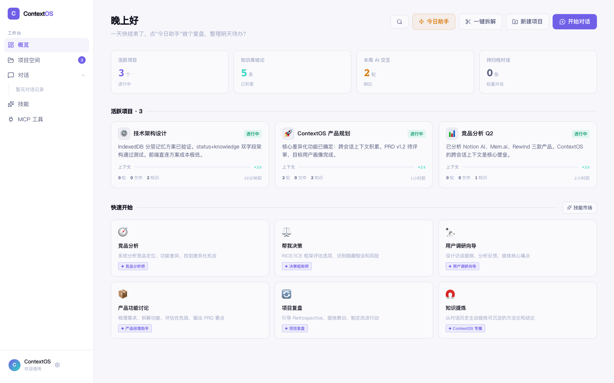
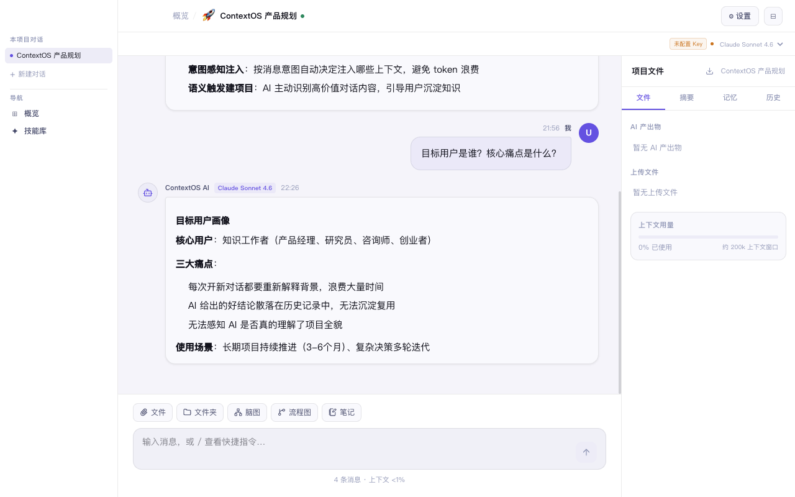
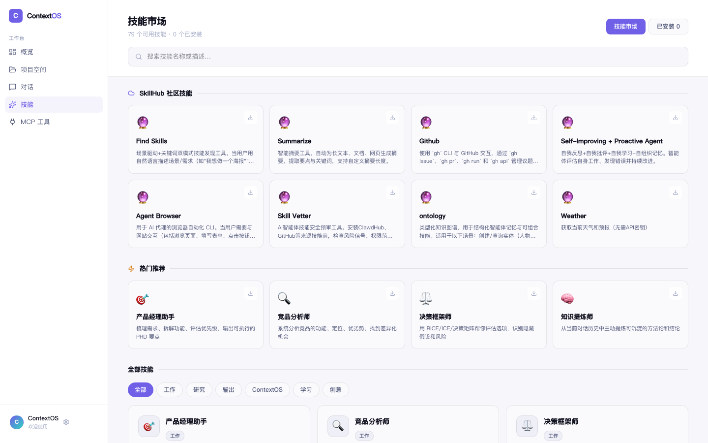
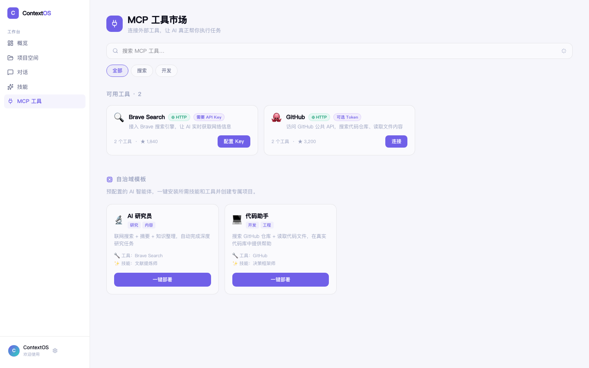

# ContextOS

**以项目为中心的 AI 对话工作台。** AI 对话产生的知识，能被下一次对话继承——你不再需要每次重新解释背景。

> 其他 AI 工具（ChatGPT、Claude Projects）做不到跨会话的上下文积累。ContextOS 的护城河就在这里。



---

## 为什么需要 ContextOS

你用 AI 处理同一个项目时，每次打开新对话都要重新解释：「我在做什么、目前进展到哪、之前定了什么结论」。这不是偶发痛点，是每天都在发生的摩擦。

ContextOS 的解法：

- **项目上下文自动载入** — 打开项目，AI 已经知道你在做什么
- **分层记忆** — 「当前状态」随会话更新，「知识库」只追加不覆盖，结论永远留存
- **意图感知** — 追问上次结论 vs 开新话题 vs 做决策，AI 按意图注入不同上下文，不乱
- **本地优先** — 所有数据存本地 IndexedDB，API Key 不经过服务器

---

## 核心功能

### 🧠 分层记忆

项目记忆分两层：

| 层级 | 字段 | 行为 | 用途 |
|------|------|------|------|
| 当前状态 | `status` | 每次会话后覆盖更新 | AI 快速定位你现在在哪 |
| 知识库 | `knowledge` | 只追加，带日期戳 | 结论、方法论、决策，永久保留 |

会话结束时（≥ 4 条 AI 回复），系统自动提炼本次对话的新知识追加到知识库。

### 🎯 意图感知上下文载入

发消息前，系统先判断你的意图：

- **继续话题** — 注入当前状态
- **查询历史** — 检索知识库相关条目注入
- **做决策** — 状态 + 知识库一起注入
- **新话题** — 跳过历史上下文，避免污染

### ✦ 技能库

14 个面向知识工作者的内置技能，可绑定到项目或单次对话：

**工作类**：产品经理助手、竞品分析师、决策框架师、项目复盘、向上沟通、会议引导师

**研究类**：用户调研向导、文献提炼师、市场调研

**输出类**：演讲叙事师、反驳模拟器、技术方案评审

**ContextOS 专属**：知识提炼师、上下文整理师

技能与项目上下文合并注入 system prompt，把「角色能力」和「项目记忆」结合。

### ⚡ 一键拆解目标

输入大目标，AI 自动拆分为 3-6 个可独立执行的子项目，一键批量创建。

### 🔄 语义触发建项目

除了对话轮次触发，系统还能语义判断：当 AI 回复产生了高价值可复用内容（明确结论、可复用方法、关键决策），自动提示将当前对话升级为项目。

### ⬡ MCP 工具集成

连接外部 MCP 服务（Brave Search、GitHub 等），让 AI 在对话中直接调用工具。内置 Agent 模板：AI 研究员、代码助手。

### 📁 文件支持

上传文件，AI 自动提取内容并纳入对话上下文，支持：PDF、Word (.docx)、Excel (.xlsx)、纯文本。

### 📊 图表渲染

AI 输出 Mermaid 语法，自动渲染流程图；输出 Markdown 大纲，自动渲染思维导图（markmap）。

---

## 界面截图

| 概览页 | 项目对话页 |
|--------|-----------|
|  |  |

| 技能库 | MCP 工具页 |
|--------|-----------|
|  |  |

---

## 快速开始

### 环境要求

- Node.js 18+
- macOS（Electron 版本）/ 现代浏览器（网页版）

### 安装

```bash
git clone https://github.com/your-username/contextos.git
cd contextos
npm install
```

### 开发

```bash
# 网页版
npm run dev

# Mac 客户端
npm run dev:electron
```

### 构建 Mac App

```bash
npm run build:mac
# 产物在 release/ 目录
```

### 配置 API Key

启动后，点击左下角头像 → 设置，填入：

- **Claude API Key**（推荐）：[console.anthropic.com](https://console.anthropic.com)
- **OpenAI API Key**（可选）：[platform.openai.com](https://platform.openai.com)
- **Ollama**（本地模型）：默认连接 `http://localhost:11434`

API Key 只存本地 localStorage，不经过任何服务器。

---

## 技术栈

| 层 | 选型 |
|----|------|
| 框架 | React 19 + Vite 8 |
| 路由 | React Router 7（HashRouter） |
| 样式 | CSS Variables，无 Tailwind |
| 存储 | IndexedDB（idb），无后端 |
| 桌面端 | Electron 42，hiddenInset 标题栏 |
| 图表 | Mermaid 11 + markmap |
| 文件解析 | pdfjs-dist、mammoth、xlsx |
| LLM | 前端直连，支持 Claude / GPT-4o / Ollama / 兼容 API |

---

## 支持的模型

| 模型 | 说明 |
|------|------|
| Claude Sonnet 4.6 | 默认，推荐日常使用 |
| Claude Opus 4.8 | 复杂任务 |
| GPT-4o | 需要 OpenAI Key |
| Ollama | 本地模型，完全离线 |
| 兼容 API | 任意 OpenAI 格式的第三方 API |

---

## 项目结构

```
contextos/
├── electron/           # Electron 主进程
├── src/
│   ├── pages/
│   │   ├── Overview.jsx       # 概览页
│   │   ├── ProjectChat.jsx    # 项目对话页（核心）
│   │   ├── SkillsPage.jsx     # 技能市场
│   │   └── MCPPage.jsx        # MCP 工具集成
│   ├── components/
│   │   ├── FilePanel.jsx      # 右侧文件/摘要/历史面板
│   │   ├── ChatMessage.jsx    # 对话气泡
│   │   ├── ArtifactCard.jsx   # 产出物卡片（Mermaid/markmap）
│   │   ├── InputBar.jsx       # 底部输入栏
│   │   ├── DecomposeModal.jsx # 一键拆解目标
│   │   └── ProjectCard.jsx    # 项目卡片
│   ├── lib/
│   │   ├── llm.js             # LLM 调用（Claude/GPT/Ollama）
│   │   ├── memory.js          # AI 反思记忆
│   │   ├── contextBuilder.js  # 意图感知上下文构建
│   │   ├── intentDetector.js  # 用户意图检测
│   │   ├── trigger.js         # 建项目触发逻辑
│   │   ├── skills.js          # 技能库
│   │   └── mcp.js             # MCP 工具集成
│   └── store/
│       └── db.js              # IndexedDB 封装
└── package.json
```

---

## Roadmap

- [x] 知识库自动整合（条目 ≥ 8 时显示「整合」按钮，AI 去重压缩）
- [x] 导出项目为 Markdown 文档（右侧面板下载按钮）
- [x] SkillHub 社区技能市场（Electron 直连，Web 降级展示内置技能）
- [x] Windows / Linux 支持（`npm run build:win` / `npm run build:linux`）
- [ ] 多设备同步（可选云端）

---

## License

MIT
